<div align="center">



<br/>


<br/>

<a href="https://www.linkedin.com/in/suryansh-chaturvedi-0bb431192/"></a>
<a href="mailto:suryansh.official100@gmail.com"></a>


</div>

<br/>

## Hello

I'm Suryansh. I started writing code at 13 and never really found a reason to stop.

What I like is the layer underneath the framework — storage engines, write-ahead logs, query
planners. The stuff you only understand properly by building one badly first, which is roughly
how the database below came about.

Off the keyboard I'm usually watching anime, or losing an evening to someone's blog post about
how their database survives a power cut. Occasionally both at once.

<br/>

## Featured work

<table>
<tr>
<td width="50%" valign="top">

### [glassdb](https://github.com/suryansh98/glassdb)
**A SQL database you can see inside**

An embedded database engine written from scratch in Go — with **zero third-party dependencies.**
Standard library only.

</td>
<td width="50%" valign="top">

### [biomedical-rag-qa](https://github.com/suryansh98/biomedical-rag-qa)
**Retrieval-augmented QA over PubMed**

A four-person MSc NLP project at Universität Heidelberg. I built the LLM answering layer.

</td>
</tr>

<tr>
<td valign="top">

- Paged storage, B+tree indexes, LRU buffer pool
- Write-ahead log, SQLite-style crash recovery
- Per-frame CRC and torn-write detection
- Recovery proven by a fault-injecting filesystem
- Hand-written SQL parser and query planner
- Live event-stream visualiser (`xray`)

</td>
<td valign="top">

- PubMed abstracts scraped, cleaned and chunked
- Chunk embeddings indexed in a Pinecone vector DB
- Answering layer on **Llama-2-13b-chat**
- Evaluated against a generated question set
- Retrieval and generation split into own stages
- Team project, written up as an MSc report

</td>
</tr>

<tr>
<td valign="bottom">

```
~7k LOC  ·  76% coverage  ·  0 dependencies
```


</td>
<td valign="bottom">

```
Python  ·  Llama 2  ·  RAG  ·  Pinecone
```


</td>
</tr>
</table>

<br/>

## Tools of the trade

<div align="center">

<table>
<tr><td align="right"><b>Languages</b></td><td>

</td></tr>
<tr><td align="right"><b>Frontend</b></td><td>

</td></tr>
<tr><td align="right"><b>Backend&nbsp;&amp;&nbsp;Data</b></td><td>

</td></tr>
<tr><td align="right"><b>Cloud&nbsp;&amp;&nbsp;DevOps</b></td><td>

</td></tr>
<tr><td align="right"><b>Observability&nbsp;&amp;&nbsp;Testing</b></td><td>

</td></tr>
</table>

`REST` · `System Design` · `CI/CD` · `Agile/Scrum` · `SAST` · `Playwright` · `React Native` · `Loki` · `LLM` · `RAG`

</div>

<br/>

## By the numbers

<div align="center">


<br/>


<br/>


</div>

<br/>

## Contribution graph, eaten by a snake

<div align="center">

<picture>
  <source media="(prefers-color-scheme: dark)" srcset="https://raw.githubusercontent.com/suryansh98/suryansh98/output/github-snake-dark.svg" />
  <source media="(prefers-color-scheme: light)" srcset="https://raw.githubusercontent.com/suryansh98/suryansh98/output/github-snake.svg" />
  
</picture>

</div>

<br/>

---

<div align="center">

### Get in touch

Always happy to talk about storage internals, payments plumbing, or anything with a hard systems
problem underneath it.

<a href="mailto:suryansh.official100@gmail.com"><b>suryansh.official100@gmail.com</b></a>
&nbsp;·&nbsp;
<a href="https://www.linkedin.com/in/suryansh-chaturvedi-0bb431192/"><b>LinkedIn</b></a>

<br/><br/>


</div>
